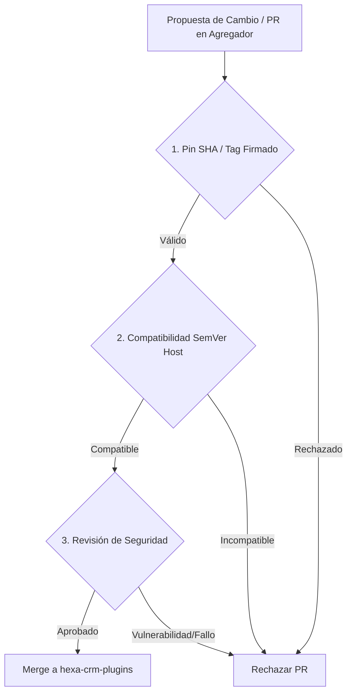

# Contrato de Integración Host-Plugin (HEXA-CRM)

Este documento define la especificación técnica, la separación de responsabilidades, los límites de seguridad y las políticas de aceptación que rigen la integración de plugins en **HEXA-CRM**.

> [!NOTE]
> Para la guía operativa de configuración e inventario de plugins por tenant, consulta la [Documentación de Plugins](PLUGINS.md).

---

## 1. Desacoplamiento y Separación de Responsabilidades

La arquitectura de plugins establece una frontera rígida entre el CRM Host, los repositorios de plugins individuales y el agregador central de submódulos.

### 1.1 CRM Host (`hexa-crm`)
El CRM Host es el único responsable de la orquestación, seguridad y persistencia contextual del sistema:
- **Aislamiento Multi-Tenant**: Aplica segregación estricta por `company_id` en cada invocación de plugin.
- **Control de Acceso y RBAC**: Verifica los permisos del usuario autorizador antes de ejecutar cualquier herramienta (*tool*).
- **Gestión de Secretos por Referencia**: El Host sólo gestiona referencias a variables de entorno (`HEXA_*`). Está prohibido almacenar llaves de API, credenciales o tokens en texto plano dentro de la base de datos (`tenant_plugins`).
- **Auditoría Inmutable**: Registra todas las ejecuciones en `plugin_audit_log` detallando `company_id`, `user_id`, `plugin_key`, `tool_name` y estado, asegurando que no se registren argumentos con información sensible ni secretos.
- **Confirmación Humana Obligatoria**: Implementa un *gatekeeper* interactivo (`require_approval`) que interrumpe el flujo y exige aprobación explícita del usuario para cualquier herramienta con capacidad de escritura o modificación de datos.

### 1.2 Repositorio de Plugin Individual
Cada plugin se desarrolla y mantiene en su propio repositorio independiente:
- Aloja el código fuente desacoplado, adaptadores y manejadores de herramientas (*handlers*).
- Define los esquemas tipados y machine-readable de entrada y salida de sus herramientas.
- Mantiene sus propias pruebas unitarias y de integración sin depender del runtime completo del Host.

### 1.3 Agregador Central (`git@github.com:HEXA-NIX/hexa-crm-plugins.git`)
El agregador actúa exclusivamente como el catálogo oficial de versiones de plugins:
- Contiene **ÚNICAMENTE** referencias a submódulos de Git (`.gitmodules` y gitlinks).
- No contiene código ejecutable de runtime en su directorio raíz ni lógica de negocio propia.

---

## 2. Prohibición Estricta de Código Remoto Arbitrario (RCE Protection)

Para prevenir vulnerabilidades de ejecución de código remoto (RCE) y modificaciones no auditadas en producción:

1. **Sin Carga Dinámica en Runtime**: Queda estrictamente prohibido cargar scripts, binarios o módulos JS/TS en tiempo de ejecución a través de HTTP, WebSocket, CDNs o APIs de evaluación dinámica (`eval()`, `new Function()`).
2. **Inclusión Estática y Determinista**: Todo código ejecutable debe provenir de submódulos de Git previamente auditados, clonados e incluidos estáticamente durante la fase de *build* o empaquetado del Host.
3. **Inmutabilidad en Despliegue**: No se permite la descarga ni actualización caliente (*hot-reloading*) de código ejecutable sin pasar por el pipeline de validación y compilación oficial del CRM Host.

---

## 3. Estructura del Agregador de Submódulos

El repositorio agregador `git@github.com:HEXA-NIX/hexa-crm-plugins.git` debe estructurarse utilizando el patrón estandarizado de submódulos con placeholders descriptivos:

```text
hexa-crm-plugins/
├── .gitmodules
└── plugins/
    ├── <plugin-id-1>/
    │   └── (gitlink -> git@github.com:HEXA-NIX/hexa-plugin-<plugin-id-1>.git @ <commit-sha-o-tag-firmado>)
    └── <plugin-id-2>/
        └── (gitlink -> git@github.com:HEXA-NIX/hexa-plugin-<plugin-id-2>.git @ <commit-sha-o-tag-firmado>)
```

### Configuración Estándar de `.gitmodules` (Ejemplo con Placeholders)
```ini
[submodule "plugins/<plugin-id>"]
	path = plugins/<plugin-id>
	url = git@github.com:HEXA-NIX/hexa-plugin-<plugin-id>.git
	ignore = untracked
```

*Nota: No se deben hardcodear URLs específicas de repositorios no creados ni versiones ficticias.*

---

## 4. Puertas de Validación y Criterios de Aceptación (Gatekeeping)

Antes de actualizar un pointer o mergear un PR en `hexa-crm-plugins.git`, la modificación debe superar los siguientes tres controles de calidad y seguridad:



1. **Validación de Pinning Inmutable (SHA / Tag Firmado)**:
   - El submódulo debe apuntar a un SHA de commit inmutable o a una etiqueta Git firmada mediante GPG/SSH (`git tag -v`). No se admiten referencias a ramas flotantes (`main`, `dev`, `HEAD`).
2. **Matriz de Compatibilidad con el Host (SemVer)**:
   - El plugin debe declarar en su manifiesto la versión del contrato de API compatible con el CRM Host (`hostApiVersion`). Modificaciones breaking en la API del Host requieren una actualización mayor correspondiente.
3. **Auditoría y Revisión de Código de Seguridad**:
   - Auditoría obligatoria previa a la inclusión: Análisis estático de código (SAST), verificación de ausencia de llamadas I/O no autorizadas y revisión por parte del equipo de seguridad.

---

## 5. Estrategia de Transición para Plugins Existentes

Los plugins actuales integrados directamente en el CRM Host (`database_bridge` y `stripe_mcp`) se mantienen in-tree hasta completar la transición, siguiendo este plan de migración:

- **Estado Actual**: Implementación in-tree en `src/lib/plugins/` (`catalog.ts`, `runtime.server.ts`, `postgres-db.ts`), donde `database_bridge` y `stripe_mcp` continúan in-tree y operativos.
- **Fase 1 (Planificada)**: Extracción del código fuente de `database_bridge` y `stripe_mcp` hacia repositorios dedicados aún por designar, con sus URLs y pins estables pendientes de aprobación.
- **Fase 2 (Planificada)**: Inserción de los submódulos en `git@github.com:HEXA-NIX/hexa-crm-plugins.git` bajo control de versiones y auditoría.
- **Fase 3 (Planificada)**: Sustitución de los handlers in-tree por la carga estática vinculada al agregador.

> [!WARNING]
> Esta transición se encuentra en **fase de diseño y desarrollo activo**. El código in-tree de `database_bridge` y `stripe_mcp` permanece in-tree y plenamente operativo hasta completar la extracción y validación de las puertas de seguridad.

---

## 6. Referencias Cruzadas

- [PLUGINS.md](PLUGINS.md) - Manual de administración y secrets por tenant en HEXA-CRM.
